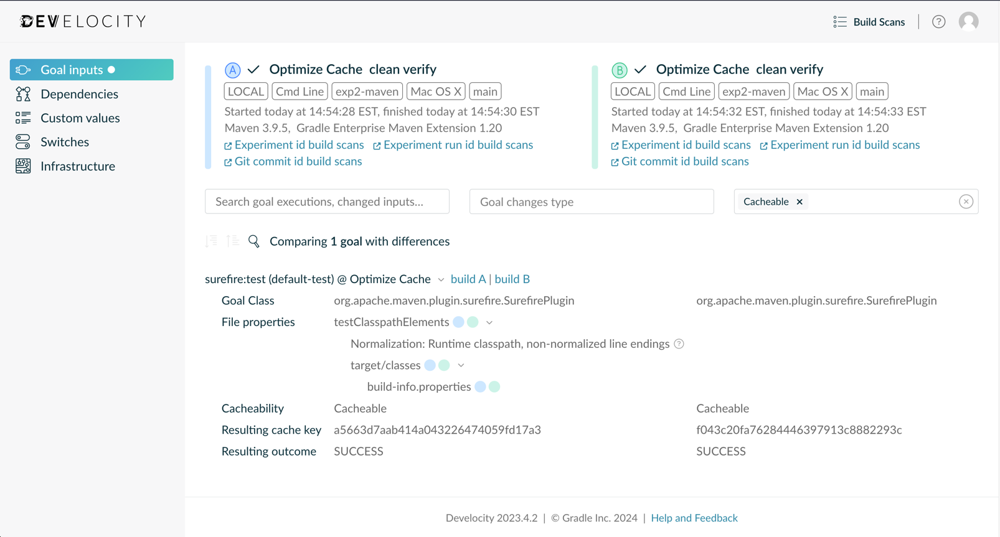

Lab: Maintaining an Optimized Build Cache
=============================

This lab demonstrates how to monitor for build cache misses using [build-validation-scripts][build-validation-scripts]. These scripts will run two builds and then check for cache misses between them.
These scripts can be run locally and via CI.  We recommend configuring your CI system to run them at least weekly.  This repository demonstrates how to do this with GitHub Actions, but the instructions would be similar for any other CI system.

## Running the scripts locally

Steps
-----

1. Clone this repository and change to it's directory.
2. If you have not done so already, authenticate Maven with the Develocity instance.
    
    > **NOTE:** Your user **MUST** have the "Access build data via the API" permission, if you do not have the permission, contact your Develocity administrator. Once you have the permission, you will need to provision a new access key.
    
    <details>

   Run the following command and follow the instructions in your terminal:

    ```shell
    ./mvnw com.gradle:gradle-enterprise-maven-extension:provision-access-key
    ```
   > **NOTE:** For more ways to authenticate, see the [authentication guide](https://docs.gradle.com/enterprise/maven-extension/#authenticating_with_gradle_enterprise) to see how to provide credentials.

    </details>

3. Notice how `pom.xml` filters the build timestamp into `src/main/resources/build-info.properties`, this will create a build cache miss.

    > **NOTE:** As of this writing the version of the Build Validation Scripts is `2.5.1`, check the [repository][build-validation-scripts] for the latest version.

4. Set shell variables to containing the version and checksum:
    
    ```shell
    version="2.5.1"
    # You can find the SHA 512 checksum on the releases page:
    # https://github.com/gradle/gradle-enterprise-build-validation-scripts/releases
    checksum="131fb1a0de2409d7f1747bd0da75680e757d791596a81f43787f36badf40f1385aa593ab053c1b396a1bcbf6b9da64cc355e78c04eb55ff5d0a6526a5f318e54"
    ```

5. Download and extract the build validation scripts zip file:

    ```shell
    # Download and extract in temp directory
    pushd /tmp
    # Download scripts zip
    curl -s -L -O "https://github.com/gradle/gradle-enterprise-build-validation-scripts/releases/download/v${version}/gradle-enterprise-maven-build-validation-${version}.zip"
    # Verify zip
    echo "${checksum}  gradle-enterprise-maven-build-validation-${version}.zip" | shasum -a 512 -c-
    # Extract Build Validation Scripts
    unzip -q -o gradle-enterprise-maven-build-validation-${version}.zip
    popd
    ```

6. Execute the build validation script to run two build in different directories:

    ```shell
    /tmp/gradle-enterprise-maven-build-validation/02-validate-local-build-caching-different-locations.sh \
      --git-repo "$(pwd)" \
      --goals verify \
      --fail-if-not-fully-cacheable
    ```

    After both builds finish you will see Summary and Investigation Quick Links sections, click on the "Goal inputs comparison" link, to view the differences in the inputs. Notice that the `build-info.properties` file is different.

    

7. See the [`.github/workflows/cron-shell-script.yml`](.github/workflows/cron-shell-script.yml) to automate this process.

    > **NOTE:** The above `cron-shell-script.yml`, performs each of the steps mentioned above to demonstrate how these steps could be run on any CI system.  If you are using GitHub Actions, these steps can be simplified by using a shared Action, see [`.github/workflows/cron-shared-action.yml`](.github/workflows/cron-shared-action.yml)

[build-validation-scripts]: https://github.com/gradle/gradle-enterprise-build-validation-scripts